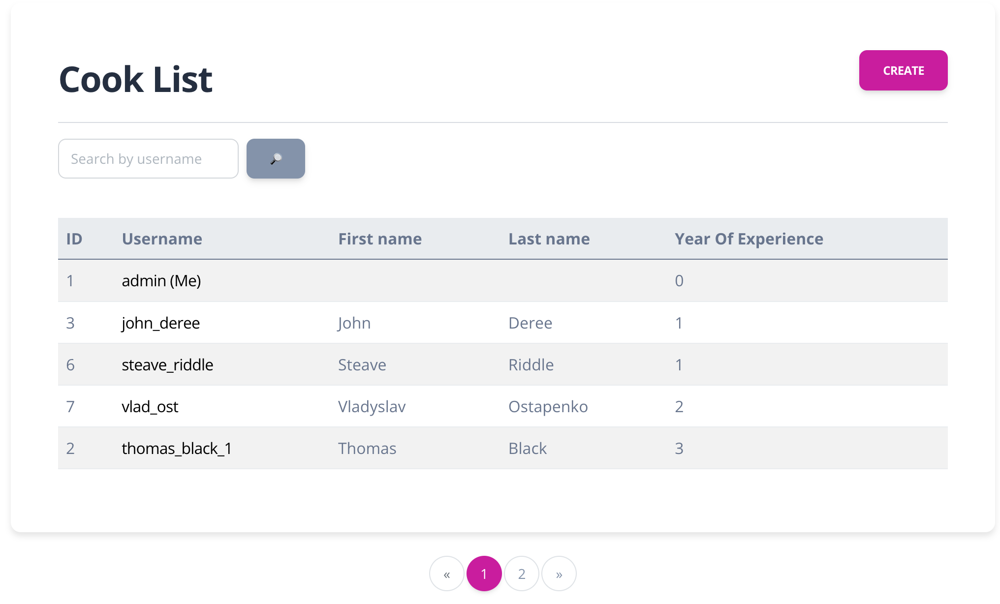

# Restaurant-Kitchen-Service Project

Django project for managing dish and cooks in Restaurant

## Check it out!

[Restaurant-Kitchen-Service project deployed to Render](https://restaurant-kitchen-service.render.com/)

## Installation

Python3 must be already installed

```shell
git clone https://github.com/VladPh1/restaurant-kitchen-service
cd restaurant-kitchen-service
python3 -m venv venv
source venv/bin/activate
pip install -r requirements.txt
python manage.py runserver # starts Django server
```

## Features

* Authentification functionality fok Cook/User
* Managing dish cook's & dish type directly from website interface
* Powerful admin panel for advanced managing

## Demo

